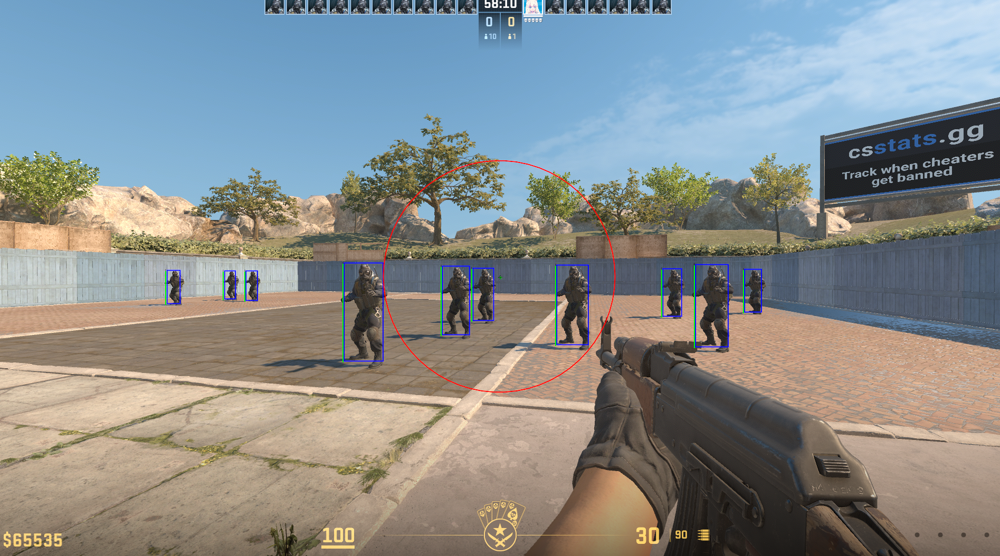

# CS2 External Cheat 🎮

Проект создан в образовательных целях для изучения работы с памятью процессов и создания оверлеев. Включает функции ESP, AimBot и TriggerBot для Counter-Strike 2. **Использование в реальной игре может привести к блокировке аккаунта.**



---

## 🌟 Возможности
| Модуль          | Функции                                                                 |
|-----------------|-------------------------------------------------------------------------|
| **Dynamic ESP**  | Боксы с цветовой индикацией видимости, HP-бары, фильтр союзников       |
| **Smart Aim**    | Плавный аимбот с FOV-кольцом, выбор костей (голова/грудь), анти-снап   |
| **Hyper Trigger**| Настраиваемые задержки (рандомизация), режим "All-in-One", проверка LOS|

---

## ⚙️ Требования
- Windows 10/11  
- Python 3.10+  
- Игра CS2 в оконном режиме  

---

## 📥 Установка
1. Установите зависимости:  
   ```bash
   pip install pymem imgui glfw pywin32 requests opencv-python
   ```
2. Склонируйте репозиторий:  
   ```bash
   git clone https://github.com/ваш-ник/CS2-External-Cheat.git
   ```

---

## 🚀 Использование
1. Запустите CS2.  
2. Запустите `Main.py`:  
   ```bash
   python Main.py
   ```
3. Настройки по умолчанию:  
   - **AimBot**: Клавиша `C`  
   - **TriggerBot**: Клавиша `X`  

---

## 🔧 Сборка EXE
Соберите проект в exe с шифрованием:  
```bash
pyinstaller --onefile --key=-KEY-#Key Main.py
```

---

## ⚠️ Предупреждение
- Проект создан **только для образовательных целей**.  
- Использование в мультиплеерных играх нарушает правила платформ (Steam, Faceit, ESEA).  
- Автор не несет ответственности за последствия.  

---

## 📜 Лицензия
MIT License. Распространяется "как есть".  
